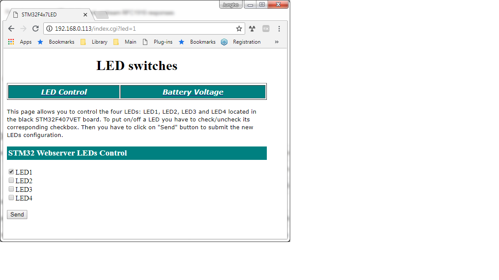
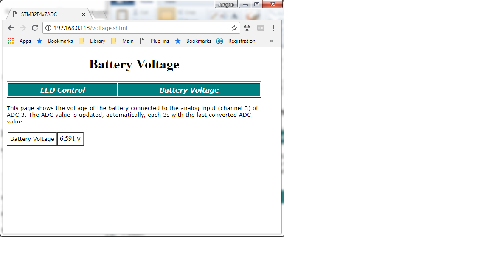

## Embedded Web
This is an embedded web site to control LEDs and report the battery voltage. It is constructed with a STM32F407 black board and a LAN8720 Ethernet RMII interface card. I generated the RMII interface code for LAN8720, LwIP, http server, and FreeRTOS using STM32Cube. Although STM32F407 is reasonably fast at 144MHz, it is still not fast enough for a dynamic web site. I simplified the html files with manual HTML coding and added codes for common gateway interface (CGI) to control LEDs and server side include (SSI) to show the status of the LEDs and measured battery voltage using an ADC.

### LED control page

### Battery voltage page

